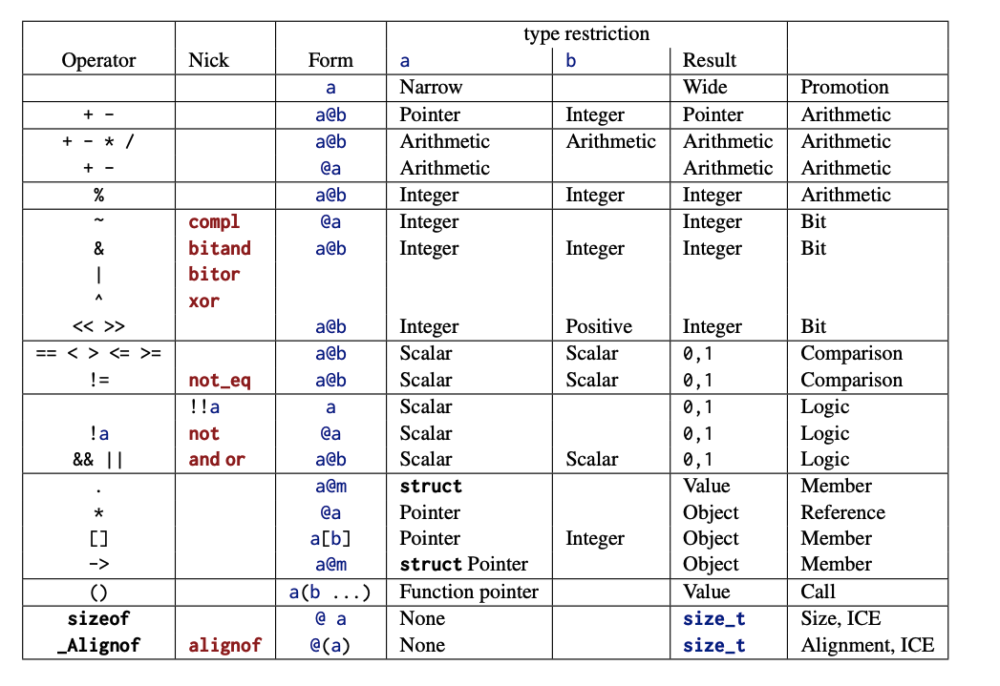
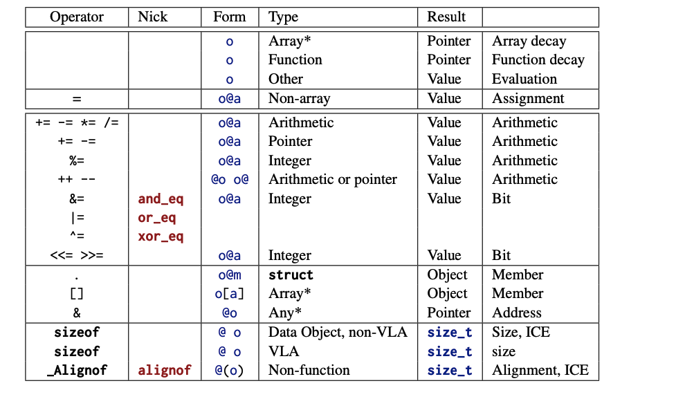
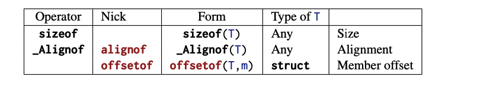

# Expressing computations

This section covers
- Performing arithmetic
- Modifying objects
- Working with booleans
- Conditional compilation with the ternary operator
- Setting the evaluation order

Note: The type size_t represents values in the range [0, SIZE_MAX].
The value of SIZE_MAX is quite large. Depending on the platform, it is one of
2^16 − 1 = 65535
2^32 − 1 = 4294967295
2^64 − 1 = 18446744073709551615

## 1. Arithmatic Operations
### Value Operators
The Form column gives the syntactic form of the operation, where @ represents the operator and a and possibly b denote values that serve as operands. For arithmetic and bit operations, the type of the result is a type that reconciles the types of a and b. For some of the operators, the Nick column gives an alternative form of the operator, or lists a combination of operators that has special meaning.



### Object Operators
the Form column gives the syntactic form of the operation, where @ represents the operator, o denotes an object, and a denotes a suitable additional value (if any) that serves as an operand. An additional * in the Type column requires that the object o be addressable.



### Type Operators
these operators return an integer constant (ICE) of type size_t. They have function-like syntax with the operands in parentheses.



- Unsigned arithmetic is always well defined
- The operations +, -, and * on size_t provide the mathematically correct result if it is representable as a size_t
- For unsigned values, a == (a/b)*b + (a%b).
- Unsigned / and % are well defined only if the second operand is not 0.
- Arithmetic on size_t implicitly does the computation %(SIZE_MAX+1).
- In the case of overflow, unsigned arithmetic wraps around.
- The result of unsigned / and % is always smaller than the operands.
- Unsigned / and % can’t overflow.


## 2. Operators that modify objects

C has other assignment operators. For any binary operator @, the five we have seen all have the syntax
`an_object @= some_expression;`
They are just convenient abbreviations for combining the arithmetic operator @ and
assignment; A mostly equivalent form is
`an_object = (an_object @ (some_expression));`

The syntax of these operators is a bit picky. You aren’t allowed to have blanks between the different characters: for example, i + = 7 instead of i += 7 is a syntax error.

- Operators must have all their characters directly attached to each other.
- Side effects in value expressions are evil.
- Never modify more than one object in a statement.


## 3. Boolean Context

Several operators yield a value 0 or 1, depending on whether some condition is verified;
They can be grouped in two categories: compar- isons and logical evaluation.

1. Comparison
We already have seen the comparison opera- tors ==, !=, <, and >. Whereas the latter two perform strict comparisons between their operands, the operators <= and >= perform “less than or equal” and “greater than or equal” comparisons, respectively.

- Comparison operators return the value false or true.
- Remember that false and true are nothing more than fancy names for 0 and 1, respectively. So, they can be used in arithmetic or for array indexing.

2. Logic

Logic operators operate on values that are already supposed to repre- sent a false or true value. If they do not, the rules described for conditional execution apply first.
The operator ! (not) logically negates its operand, operator && (and) is logical and, and operator || (or) is logical or.

- Logic operators return the value false or true.
- The operators && and || have a particular property called short-circuit evaluationC . This barbaric term denotes the fact that the evaluation of the second operand is omitted if it is not necessary for the result of the operation:

## 4. The ternary or conditional operator

The ternary operator is similar to an if statement, but it is an expression that returns the value of the chosen branch:
```
size_t size_min(size_t a, size_t b) {
  return (a < b) ? a : b;
}
```
Similar to the operators && and ||, the second and third operand are evaluated only if they are really needed.

## 5. Evaluation Order

Of the operators so far, we have seen that &&, ||, and ?: condition the evaluation of some of their operands. This implies in particular that for these operators, there is an evaluation order for the operands: the first operand, since it is a condition for the remaining ones, is always evaluated first:
- &&, ||, ?:, and , evaluate their first operand first.
The comma (,) is the only operator we haven’t introduced yet. It evaluates its operands in order, and the result is the value of the right operand. For example, (f(a), f(b)) first evaluates f(a) and then f(b); the result is the value of f(b).Be aware that the comma character plays other syntactical roles in C that do not use the same convention about evaluation. For example, the commas that separate initializations do not have the same properties as those that separate function arguments.
The comma operator is rarely useful in clean code, and it is a trap for beginners: A[i, j] is not a two-dimensional index for matrix A, but results in A[j].
- Don't use the , operator

- Most operators don’t sequence their operands
- Function calls don’t sequence their argument expressions.
- Functions that are called inside expressions should not have side effects.

## Summary
- Arithmetic operators do math. They operate on values.
- Assignment operators modify objects.
- Comparison operators compare values and return 0 or 1.
- Function calls and most operators evaluate their operands in a nonspecific order.
Only &&, ||, and ?: impose an ordering on the evaluation of their operands.
